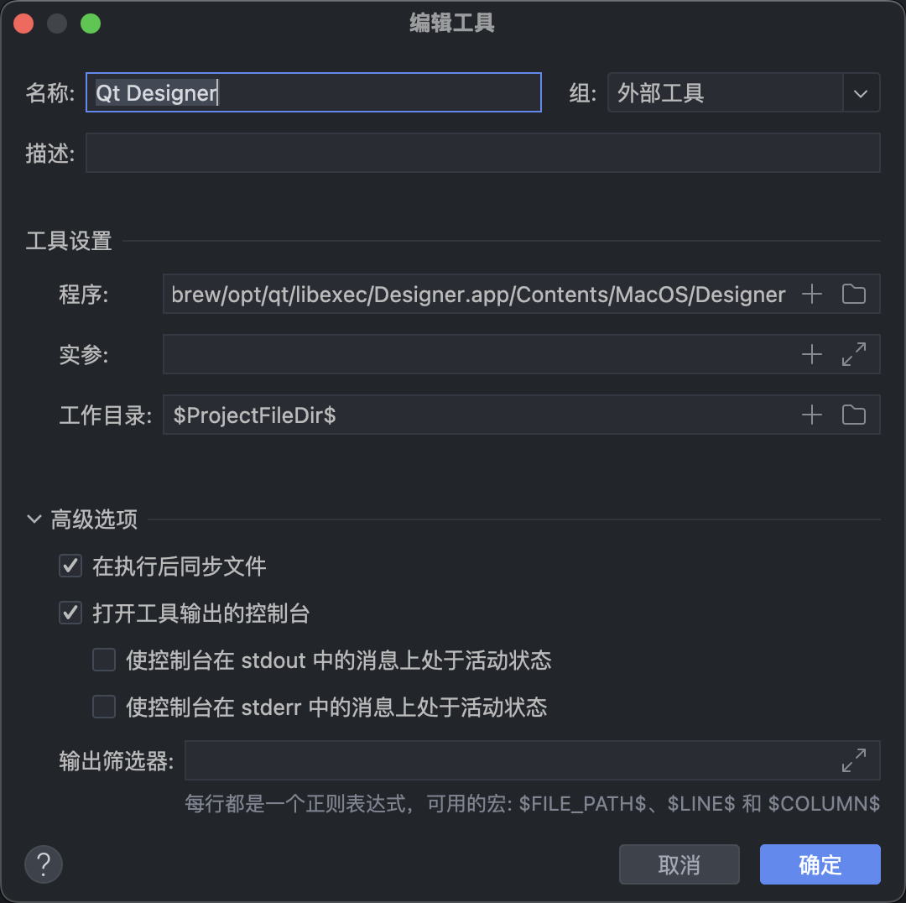
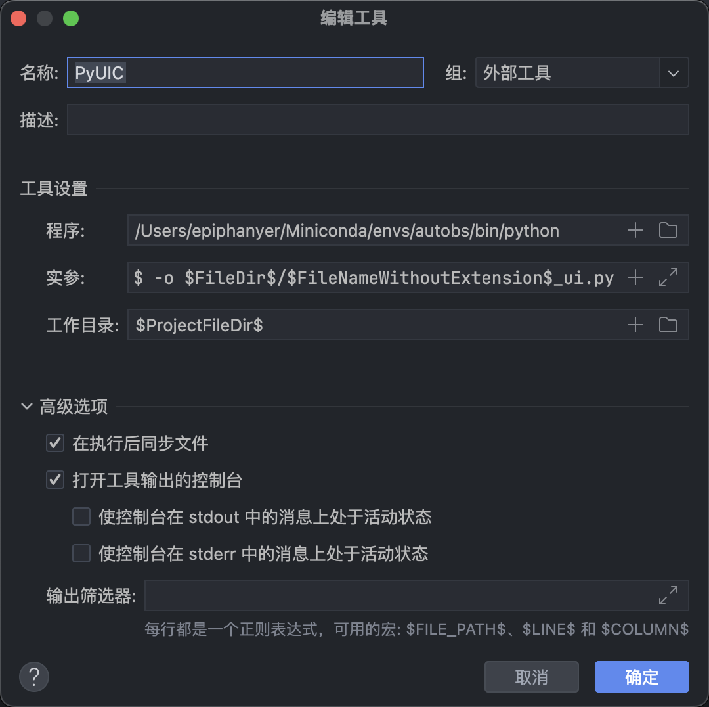

qt designer配置

/Users/epiphanyer/Library/Application Support/JetBrains/PyCharm2025.3
/opt/homebrew/Cellar/qt/6.10.2: 246 files, 180.8KB
不要用带版本号的Cellar路径，opt是brew给你的稳定软链接，Qt升级后也不容易失效。
/opt/homebrew/opt/qt/libexec/Designer.app/Contents/MacOS/Designer

pyuic配置

通过python3查看
1.打开终端输入：python3
2.导入sys包：import sys
3.查找路径 ：sys.path
得到/Users/epiphanyer/Miniconda/envs/autobs/bin/python

Arguments固定内容，如果当前工作目录不是这个文件所在目录，就会找不到。
-m PyQt5.uic.pyuic $FileName$ -o $FileNameWithoutExtension$.py
但下面这样写就是绝对路径，无论在哪个目录都能找到。
-m PyQt5.uic.pyuic $FilePath$ -o $FileDir$/$FileNameWithoutExtension$_ui.py

故pyuic最终配置：
Program
/Users/epiphanyer/Miniconda/envs/autobs/bin/python
Arguments
-m PyQt5.uic.pyuic $FilePath$ -o $FileDir$/$FileNameWithoutExtension$_ui.py
Working directory
$FileDir$

最终的操作，其实就是将.ui文件转为同名的.py文件:
/Users/epiphanyer/Miniconda/envs/autobs/bin/python 
-m PyQt5.uic.pyuic 
/Users/epiphanyer/coding/visualization/vis_apo.ui 
-o /Users/epiphanyer/coding/visualization/vis_apo_ui.py
