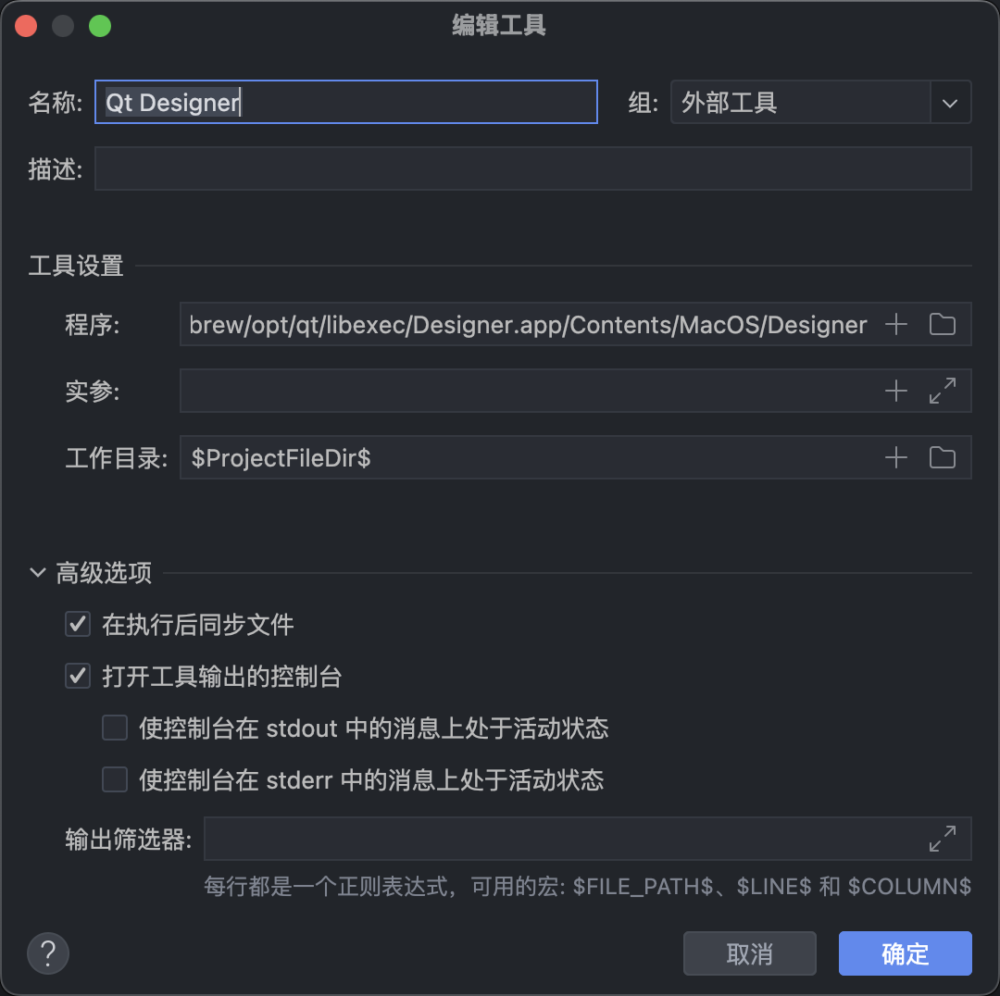
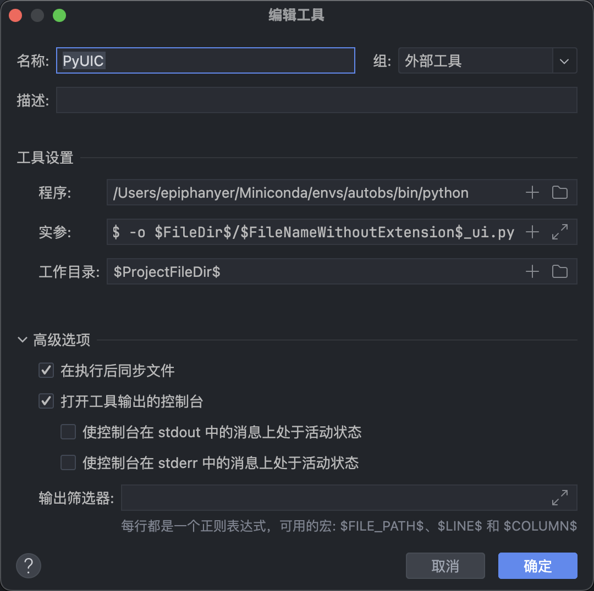

qt designer配置

/Users/epiphanyer/Library/Application Support/JetBrains/PyCharm2025.3
/opt/homebrew/Cellar/qt/6.10.2: 246 files, 180.8KB
不要用带版本号的Cellar路径，opt是brew给你的稳定软链接，Qt升级后也不容易失效。
/opt/homebrew/opt/qt/libexec/Designer.app/Contents/MacOS/Designer

pyuic配置

通过python3查看
1.打开终端输入：python3
2.导入sys包：import sys
3.查找路径 ：sys.path
得到/Users/epiphanyer/Miniconda/envs/autobs/bin/python

Arguments固定内容，如果当前工作目录不是这个文件所在目录，就会找不到。
-m PyQt5.uic.pyuic $FileName$ -o $FileNameWithoutExtension$.py
但下面这样写就是绝对路径，无论在哪个目录都能找到。
-m PyQt5.uic.pyuic $FilePath$ -o $FileDir$/$FileNameWithoutExtension$_ui.py

故pyuic最终配置：
Program
/Users/epiphanyer/Miniconda/envs/autobs/bin/python
Arguments
-m PyQt5.uic.pyuic $FilePath$ -o $FileDir$/$FileNameWithoutExtension$_ui.py
Working directory
$FileDir$

最终的操作，其实就是将.ui文件转为同名的.py文件:
/Users/epiphanyer/Miniconda/envs/autobs/bin/python 
-m PyQt5.uic.pyuic 
/Users/epiphanyer/coding/visualization/vis_apo.ui 
-o /Users/epiphanyer/coding/visualization/vis_apo_ui.py

## ReAct PyQt5 GUI

当前目录新增了一个基于 PyQt5 的 ReAct 可视化主界面：

- 启动命令：
  - `/Users/epiphanyer/Miniconda/envs/autobs/bin/python visualization/react_decision_gui.py`

- 运行说明：
  - GUI 通过 `QProcess` 调用 `ReAct.run_access_point_decision`
  - trajectory、站点 JSON、左右图缓存统一写到 `visualization/runtime/`
  - 左图包装脚本：`visualization/generate_live_roi_coverage.py`
  - 右图包装脚本：`visualization/generate_live_deployment_pred.py`

- 当前固定运行面：
  - request 仅使用 fixed / unfixed 两个 `_generated_requests`
  - planner 仅支持 `qwen`、`llamafactory`
  - 默认后续决策方法为 `LLM可解释性权重`

## ReAct Web GUI

在无桌面的 autodl 控制台中，建议使用 Web 版本而不是 PyQt5 桌面窗口：

- 启动命令：
  - `python visualization/web_app.py --host 0.0.0.0 --port 8000`

- 打开方式：
  - 使用 autodl 的端口映射或浏览器转发访问 `http://<host>:8000`

- 接口说明：
  - `GET /api/options`
  - `POST /api/run/start`
  - `POST /api/run/stop`
  - `GET /api/run/state`

- 运行说明：
  - Web 后端仍然只包装 `ReAct.run_access_point_decision`
  - trajectory、站点 JSON、左右图缓存统一写到 `visualization/runtime/`
  - 左右图仍通过 `visualization/` 下的包装脚本调用现有链路生成
